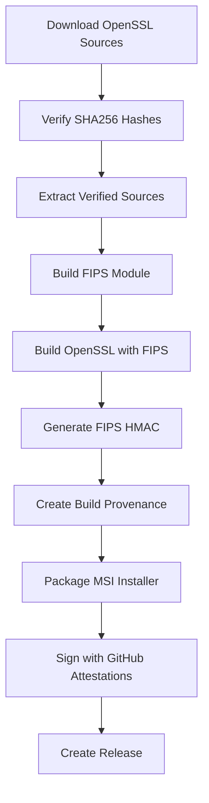

# OpenSSL FIPS Installer for Windows

[](https://github.com/fsbruva/openssl-fips-windows-installer/actions)
[](LICENSE)
[](https://www.openssl.org/)
[](https://csrc.nist.gov/pubs/fips/140-3/final)

Automated Windows installer for OpenSSL with FIPS 140-3 Provider Module, featuring cryptographic source verification, SLSA Build Provenance, and professional MSI packaging.

## 🎯 Features

- ✅ **FIPS 140-3 Compliant** - Built with validated FIPS provider module, [Certificate #4985](https://csrc.nist.gov/projects/cryptographic-module-validation-program/certificate/4985)
- ✅ **Cryptographically Verified** - All source code verified against official OpenSSL.org SHA256 hashes
- ✅ **No Source Modifications** - Pristine sources, ensuring compliance
- ✅ **SLSA Build Provenance** - Complete supply chain security documentation
- ✅ **GitHub Attestations** - Cryptographically signed via Sigstore
- ✅ **Professional MSI Installer** - Easy installation and uninstallation
- ✅ **Complete Documentation** - Build provenance, attestations, and licenses included

## 📦 What's Included

### Installed Components

After installation (default: `C:\Program Files\OpenSSL\`):

```
C:\Program Files\OpenSSL\
├── openssl.exe                      # OpenSSL command-line tool
├── openssl.cnf                      # OpenSSL configuration
├── fipsmodule.cnf                   # FIPS module configuration (with HMAC)
├── OpenSSL_Start.bat                # Wrapper script for FIPS verification
│
├── lib\
│   └── ossl-modules\
│       └── fips.dll                 # FIPS provider module
│
├── BUILD_INFO.txt                   # Build metadata and version information
├── source-verification.txt          # Source code hash verification log
├── CRYPTOGRAPHIC_ATTESTATION.txt    # FIPS compliance attestation
├── BUILD_PROVENANCE.txt             # SLSA build provenance (human-readable)
├── BUILD_PROVENANCE.json            # SLSA build provenance (machine-readable)
├── OPENSSL_LICENSE.txt              # OpenSSL Apache 2.0 license
└── THIRD_PARTY_NOTICES.txt          # Third-party software attributions
```

### Start Menu Shortcuts

- **OpenSSL CMD Prompt** - Opens Command Prompt with OpenSSL in PATH
- **OpenSSL PS Prompt** - Opens PowerShell with OpenSSL in PATH

## 🚀 Quick Start

### Installation

1. **Download the latest release:**
   ```powershell
   # Via GitHub CLI
   gh release download --repo fsbruva/openssl-fips-windows-installer --pattern "*.msi"
   ```

2. **Verify the installer** (recommended):
   ```powershell
   gh attestation verify OpenSSL-FIPS-3.X.Y.msi --repo fsbruva/openssl-fips-windows-installer
   ```

3. **Install:**
   ```powershell
   # Run as Administrator
   msiexec /i OpenSSL-FIPS-3.X.Y.msi
   
   # Or double-click the MSI file
   ```

### Verification After Installation

```powershell
# Check version
openssl.exe version

# Verify FIPS module
openssl.exe fipsinstall -in fipsmodule.cnf -module lib\ossl-modules\fips.dll -verify

# List providers (should show FIPS provider)
openssl.exe list -providers

# View build provenance
type "C:\Program Files\OpenSSL\CRYPTOGRAPHIC_ATTESTATION.txt"
type "C:\Program Files\OpenSSL\BUILD_PROVENANCE.txt"
```

## 🔐 Security & Compliance

### Cryptographic Source Verification

All source code is downloaded from official OpenSSL.org and verified against published SHA256 hashes, as 
documented in the CRYPTOGRAPHIC_ATTESTATION.txt file.

### FIPS 140-3 Compliance

Conforms to [OpenSSL FIPS Security Policy](https://csrc.nist.gov/CSRC/media/projects/cryptographic-module-validation-program/documents/security-policies/140sp4985.pdf)
- FIPS provider module built from certified source
- Self-test verification on module load
- HMAC integrity checking
- No source code modifications
- Complete build provenance documentation

### Supply Chain Security

- **SLSA Build Level 2** - Hosted build platform with attestations
- **GitHub Attestations** - Cryptographically signed via Sigstore
- **Reproducible Builds** - Same inputs produce same outputs
- **Complete Audit Trail** - All build steps logged and verifiable

## 🛠️ Building from Source

### Prerequisites

- Git (for cloning the repository)

### Build Steps

1. **Clone the repository:**
   ```powershell
   git clone https://github.com/fsbruva/openssl-fips-windows-installer.git
   cd openssl-fips-windows-installer
   ```

2. **Trigger GitHub Actions build:**
   - Push to `main` or `develop` branch, OR
   - Create a tag starting with `v` (e.g., `v1.0.0`), OR
   - Manually trigger via Actions tab → "Run workflow"

3. **Download artifacts:**
   - MSI installer available in GitHub Actions artifacts
   - Releases created automatically for version tags

## 📋 Build Process Overview

The automated build process ensures security and compliance:



### Build Configuration

- **Compiler**: Microsoft Visual Studio C++ (MSVC)
- **Architecture**: x64 (64-bit)
- **Configuration**: Release
- **Flags**: `enable-fips`, `no-shared`, `no-legacy`, `-DPEDANTIC`
- **Target**: Windows 10/11 and Windows Server 2019+

## 📚 Documentation

### Included Documentation

- **BUILD_INFO.txt** - Build metadata and version information
- **source-verification.txt** - Complete source code verification log
- **CRYPTOGRAPHIC_ATTESTATION.txt** - FIPS compliance attestation
- **BUILD_PROVENANCE.txt** - SLSA build provenance (human-readable)
- **BUILD_PROVENANCE.json** - SLSA build provenance (machine-readable)
- **OPENSSL_LICENSE.txt** - OpenSSL Apache 2.0 license
- **THIRD_PARTY_NOTICES.txt** - Third-party software attributions

### Online Resources

- [OpenSSL Official Documentation](https://www.openssl.org/docs/)
- [FIPS 140-3 Standard](https://csrc.nist.gov/pubs/fips/140-3/final)
- [SLSA Framework](https://slsa.dev/)
- [Build Workflow](.github/workflows/build-openssl-fips-wix6.yml)

## 🔧 Configuration

### Environment Variables

The installer adds OpenSSL to your PATH. For FIPS-enabled usage:

```powershell
# Set environment variables
$env:OPENSSL_CONF = "C:\Program Files\OpenSSL\openssl.cnf"
$env:OPENSSL_MODULES = "C:\Program Files\OpenSSL\lib\ossl-modules"
```

Or use the provided `OpenSSL_Start.bat` script which sets these automatically.

### Enabling FIPS Mode

FIPS mode is configured via `openssl.cnf`. The included configuration file enables FIPS by default.

To verify FIPS is active:
```powershell
openssl.exe list -providers
# Should show "fips" provider
```

## 🐛 Troubleshooting

### Common Issues

**FIPS Module Fails to Load**
```
Solution: Run the FIPS installer verification:
openssl.exe fipsinstall -in fipsmodule.cnf -module lib\ossl-modules\fips.dll -verify
```

**OpenSSL Not Found in PATH**
```
Solution: Use the Start Menu shortcuts or manually add to PATH:
$env:PATH += ";C:\Program Files\OpenSSL"
```

**Permission Errors**
```
Solution: Run installer as Administrator
Right-click MSI → "Run as administrator"
```

## 🤝 Contributing

Contributions are welcome! Please feel free to submit issues or pull requests.

### Development Workflow

1. Fork the repository
2. Create a feature branch (`git checkout -b feature/amazing-feature`)
3. Commit your changes (`git commit -m 'Add amazing feature'`)
4. Push to the branch (`git push origin feature/amazing-feature`)
5. Open a Pull Request

### Reporting Issues

Please include:
- OpenSSL version
- Windows version
- Error messages or logs
- Steps to reproduce

## 📄 License

### Installer Package

Copyright (c) 2026 Matthew Kempe ([@fsbruva](https://github.com/fsbruva))

This installer package (WiX source code, build scripts, and workflows) is licensed under the Apache License, Version 2.0.

See [LICENSE](LICENSE) for details.

### OpenSSL

This installer distributes OpenSSL 3.5.5 and the FIPS Provider Module 3.1.2, both licensed under Apache License 2.0.

Copyright (c) 1998-2024 The OpenSSL Project

See [OPENSSL_LICENSE.txt](OPENSSL_LICENSE.txt) for the complete OpenSSL license.

### Attribution

This product includes software developed by the OpenSSL Project for use in the OpenSSL Toolkit (https://www.openssl.org/).

This product includes cryptographic software written by Eric Young (eay@cryptsoft.com) and software written by Tim Hudson (tjh@cryptsoft.com).

## 👤 Author

**Matthew Kempe** ([@fsbruva](https://github.com/fsbruva))

- GitHub: https://github.com/fsbruva
- Repository: https://github.com/fsbruva/openssl-fips-windows-installer

## 🌟 Acknowledgments

- [OpenSSL Project](https://www.openssl.org/) - For the excellent cryptographic library
- [WiX Toolset](https://wixtoolset.org/) - For the MSI installer framework
- [GitHub Actions](https://github.com/features/actions) - For the CI/CD platform
- [Sigstore](https://www.sigstore.dev/) - For cryptographic signing infrastructure

## 📊 Project Status

- ✅ **Active Development** - Maintained and updated regularly
- ✅ **Production Ready** - Suitable for production use
- ✅ **FIPS Compliant** - Built with FIPS 140-3 module
- ✅ **Automated Builds** - CI/CD via GitHub Actions
- ✅ **Security Verified** - Cryptographic attestations included

## 🔗 Related Projects

- [OpenSSL](https://github.com/openssl/openssl) - Official OpenSSL repository
- [OpenSSL FIPS Provider](https://github.com/openssl/openssl/blob/master/README-FIPS.md) - FIPS module documentation
- [WiX Toolset](https://github.com/wixtoolset/wix) - Windows installer framework

## 📞 Support

For support and questions:

- 📖 Check the [documentation](#-documentation)
- 🐛 Open an [issue](https://github.com/fsbruva/openssl-fips-windows-installer/issues)

---

**Built for secure Windows deployments**
